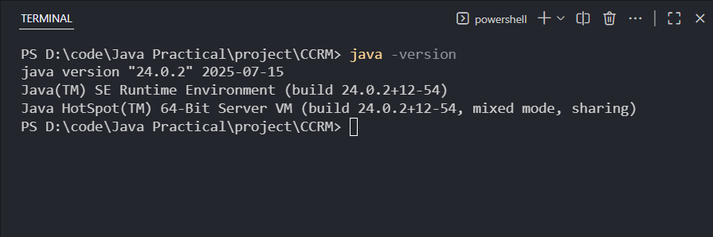
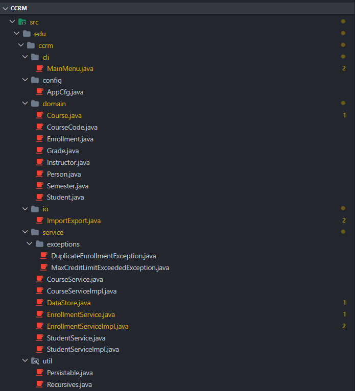
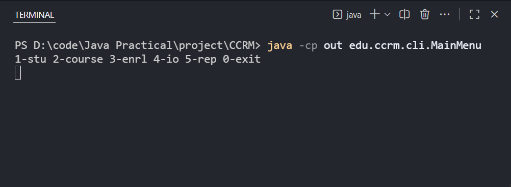
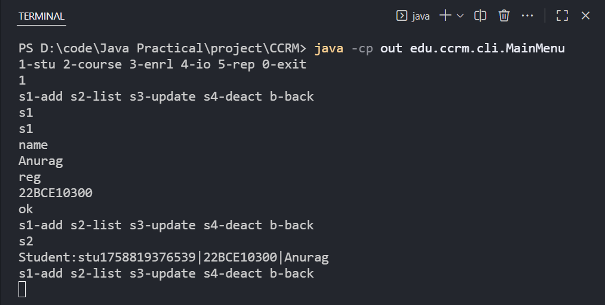

## `README.md`

markdown
# Campus Course & Records Manager (CCRM)

A console-based Java SE project for managing students, courses, enrollments, grades, transcripts, and file backups.

---

## How to Run
- **JDK**: 17 or later
- **Compile**:
  ```bash
  javac -d out $(find src -name "*.java")


* **Run**:

  ```bash
  java -cp out edu.ccrm.cli.MainMenu
  ```

---

## Evolution of Java

* **1995**: Java 1.0 released
* **1998**: Java 2 (J2SE, J2EE, J2ME introduced)
* **2004**: Java 5 added generics, annotations, enhanced for-loop
* **2011**: Java 7 introduced try-with-resources, NIO.2
* **2014**: Java 8 added lambdas, streams, Optional
* **2017**: Java 9 added modules, var (Java 10)
* **2021+**: Records, sealed classes, switch expressions
* **Current LTS**: 11, 17, 21

---

## Java ME vs SE vs EE

| Edition | Purpose                  | Example                              |
| ------- | ------------------------ | ------------------------------------ |
| **ME**  | Mobile & embedded apps   | IoT devices, feature phones          |
| **SE**  | Core standard platform   | Desktop apps, console apps like CCRM |
| **EE**  | Enterprise & server-side | Web services, Jakarta EE             |

---

## JDK, JRE, JVM

* **JDK**: Developer kit (compiler `javac`, debugger, tools, includes JRE)
* **JRE**: Runtime environment (JVM + libraries for running Java apps)
* **JVM**: Executes bytecode, provides platform independence

**Flow**:
Source `.java` → `javac` → Bytecode `.class` → JVM → Native execution

---

## Install Java on Windows

1. Download JDK (Oracle or Adoptium).
2. Run installer.
3. Set `JAVA_HOME` environment variable.
4. Add `%JAVA_HOME%\bin` to PATH.
5. Verify installation with:

   ```bash
   java -version
   ```



---

## Eclipse IDE Setup

1. Install Eclipse IDE for Java Developers.
2. **File → New → Java Project** → Name: `CCRM`.
3. Add `src/` folder and paste code.
4. Run `edu.ccrm.cli.MainMenu`.



### Running Main Menu


### Sample Operations


---

## Mapping Table (Syllabus → Code)

| Concept           | File/Class                                                        |
| ----------------- | ----------------------------------------------------------------- |
| Encapsulation     | `Student` (private fields, getters/setters)                       |
| Inheritance       | `Person` → `Student`, `Instructor`                                |
| Abstraction       | `Person` (abstract)                                               |
| Polymorphism      | `profile()` overridden                                            |
| Interfaces        | `Persistable`                                                     |
| Nested classes    | `Course.Syllabus`, `Course.Monitor`                               |
| Enums             | `Semester`, `Grade`                                               |
| Singleton         | `AppCfg`, `DataStore`                                             |
| Builder           | `Course.Builder`                                                  |
| Lambdas/Streams   | `DataStore.gpaDistribution()`                                     |
| Custom exceptions | `DuplicateEnrollmentException`, `MaxCreditLimitExceededException` |
| NIO.2             | `ImportExport.backupNow()`                                        |
| Recursion         | `Recursives.totalSize()`                                          |
| Switch & loops    | `MainMenu` menus                                                  |
| Arrays & utility  | can demo sorting regNos/course codes                              |
| Strings           | splitting/joining CSV in IO                                       |
| Date/Time API     | `Enrollment` timestamp, `AppCfg` startup time                     |
| Upcast/Downcast   | service interfaces and domain objects                             |
| Assertions        | `Course.Builder` non-null check                                   |

---

## Assertions

Enable assertions while running:

```bash
java -ea -cp out edu.ccrm.cli.MainMenu
```

---

## Errors vs Exceptions

* **Errors**: Serious, unrecoverable (e.g., OutOfMemoryError).
* **Exceptions**: Recoverable, handled via try/catch.

---

## Deliverables

* Source code in `src/`
* Test CSVs in `testdata/`
* Screenshots in `screenshots/`
* `README.md` (this file)
* `USAGE.md` (sample command guide)

---

## Acknowledgements

Developed as per VIT Bhopal Java Project specification.

```

